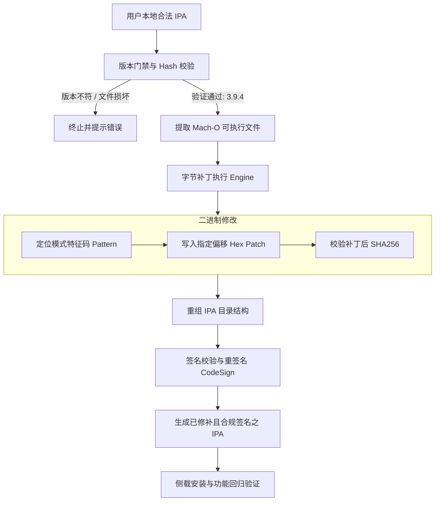

# cgm-bridge 技术架构与数据流 / Architecture

`cgm-bridge` 旨在提供针对持续葡萄糖监测（CGM）硬件的数据互操作支持，包含**路线 A（官方 App 字节补丁工具链）**与**路线 B（完全独立原生读取器）**两条路线。

---

## 1. 架构总览

```
                        ┌──────────────────────────────────────────────┐
                        │              CGM 硬件传感器                  │
                        │        (BLE Services: FF30, 180A, 180F)      │
                        └──────────────────────┬───────────────────────┘
                                               │
                       ┌───────────────────────┴───────────────────────┐
                       │                                               │
            [路线 A: 官方 App 补丁]                         [路线 B: 独立读取器]
                       │                                               │
                       ▼                                               ▼
      ┌──────────────────────────────────┐            ┌──────────────────────────────────┐
      │   用户拥有之合法官方客户端 IPA   │            │   原生跨平台客户端 / 读取引擎    │
      │       (com.sisensing.eco)        │            │   (CGMReader: iOS / Android)     │
      └────────────────┬─────────────────┘            └────────────────┬─────────────────┘
                       │                                               │
                       ▼                                               ▼
      ┌──────────────────────────────────┐            ┌──────────────────────────────────┐
      │     二进制字节补丁与重签名       │            │  CoreBluetooth / BleManager 通信 │
      │   (版本门禁校验 -> Patch -> Resign)│            │      (cmdId 0x01..0xF0 协议交互) │
      └────────────────┬─────────────────┘            └────────────────┬─────────────────┘
                       │                                               │
                       ▼                                               ▼
      ┌──────────────────────────────────┐            ┌──────────────────────────────────┐
      │      增强型官方客户端运行        │            │     协议解密与算法工程换算       │
      │  (解除非预期限制 / 增强数据导出) │            │ (ALGORITHM E1.1.5N / 离线葡萄糖) │
      └────────────────┬─────────────────┘            └────────────────┬─────────────────┘
                       │                                               │
                       │ (导出 DB/CSV)                                 ▼
                       │                              ┌──────────────────────────────────┐
                       │                              │   本地数据存储 (SQLite / JSON)   │
                       │                              └────────────────┬─────────────────┘
                       │                                               │
                       └───────────────────────┬───────────────────────┘
                                               ▼
                              ┌──────────────────────────────────┐
                              │  系统健康平台集成 (Apple HealthKit│
                              │     / Android Health Connect)    │
                              └──────────────────────────────────┘
```

---

## 2. 路线 A：官方 App 补丁工具链（Patch Toolchain）

路线 A 面向已使用官方客户端但受限于使用生命周期限制、无法导出原始数据或需增强诊断日志的高级用户。

### 2.1 数据流与操作流程



### 2.2 关键机制
1. **严格版本门禁**：通过对 Mach-O 目标二进制计算校验和与版本读取，防止因版本更新导致偏移错误而破坏二进制完整性。
2. **纯粹字节修补**：采用轻量级 Python 自动化脚本直接打补丁，无需编译时注入重型 Hook 框架，保持原汁原味的代码稳定性。
3. **隔离与重签名**：使用用户自己的开发证书或 ad-hoc 签名重新生成合规签名。

---

## 3. 路线 B：独立读取器（Standalone CGMReader）

路线 B 面向追求彻底脱离官方闭源应用、直接对接开源健康生态（如 Nightscout、Apple Health）的用户。当前阶段以前台运行为主，后台保活与守护进程属后续规划项。

### 3.1 数据流与交互流程

```mermaid
sequenceDiagram
    autonumber
    participant Sensor as CGM 传感器 (BLE)
    participant Core as CGMReader 蓝牙核心
    participant Proto as 协议解包与加解密
    participant Engine as 转换算法引擎
    participant Store as 本地持久化 (SQLite)
    participant Health as Apple HealthKit / Health Connect

    Note over Core,Sensor: 阶段 1: 扫描与服务发现 (v0 已实现)
    Core->>Sensor: CBCentralManager 扫描 (服务 FF30)
    Sensor-->>Core: 广播响应 (包含设备广播包)
    Core->>Sensor: 建立 BLE 连接
    Core->>Sensor: 发现服务 FF30, FF31, FF32, 180A, 180F

    Note over Core,Sensor: 阶段 2: 协议握手与数据交互 [规划中: v1]
    Core->>Sensor: 订阅 FF32 特征值通知
    Core->>Sensor: 发送身份认证握手指令 (cmdId: 0x01)
    Sensor-->>Proto: 返回认证响应帧 (ACK)
    Proto->>Core: 校验帧头与校验和 (Checksum)
    Core->>Sensor: 发送激活与时钟同步指令 (cmdId: 0x07)
    Sensor-->>Proto: 返回激活响应帧 (ACK)
    Core->>Sensor: 发送数据拉取指令 (cmdId: 0x08)
    Sensor-->>Proto: 流式上报原始测量帧 (Raw Data Packet)

    Note over Proto,Health: 阶段 3: 算法换算与落盘 [规划中: v2/v3]
    Proto->>Engine: 提取电流/阻抗等原始物理量
    Engine->>Engine: 执行算法换算 (ALGORITHM E1.1.5N 逻辑) [规划中: v2]
    Engine-->>Store: 写入血糖值 (mg/dL 及 mmol/L)、趋势与时间戳 [规划中: v2]
    Store-->>Health: 构建 HKQuantitySample 并异步写入 HealthKit [规划中: v3]

### 3.2 关键组件
1. **CoreBluetooth / BLE 通信器（v0 已交付）**：负责低功耗蓝牙扫描、重连保护与 Characteristic 订阅管理、原始通信帧记录。
2. **协议解包模块（规划中：v1）**：实现帧头解析、长度校验与标准协议 cmdId（`0x01` ~ `0xF0`）应答机。
3. **算法转换引擎（规划中：v2）**：实现由传感器原生信号量到标准血糖浓度（mmol/L）的离线数学转换。
4. **HealthKit / 开放健康网桥（规划中：v3）**：将计算结果标准存储为系统级葡萄糖数据，供全生态医疗健康应用读取。
